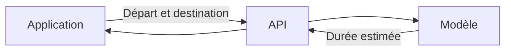
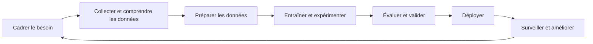

# Introduction au MLOps

Le **MLOps** regroupe les pratiques utilisées pour mettre un modèle de machine learning en production et assurer son fonctionnement dans le temps.

## Exemple : prédire la durée d'un trajet

Une application de taxi doit estimer la durée d'un trajet à partir d'un lieu de départ et d'une destination.

Le modèle reçoit les informations du trajet et retourne une durée estimée. Cette prédiction devient utile lorsqu'une application peut l'utiliser.

## Rendre le modèle accessible

Le modèle est exposé à travers une **API**. L'application envoie les informations du trajet à cette API et reçoit la durée estimée.

Le modèle effectue la prédiction. L'API permet aux autres applications d'y accéder.

## Le cycle selon [Google Cloud](https://docs.cloud.google.com/architecture/mlops-continuous-delivery-and-automation-pipelines-in-machine-learning)

Google Cloud décrit les étapes suivantes :

1. Définir le besoin métier et les critères de réussite.
2. Extraire les données.
3. Analyser les données.
4. Préparer les données.
5. Entraîner le modèle.
6. Évaluer le modèle.
7. Valider le modèle.
8. Déployer le modèle.
9. Surveiller ses performances.

La validation vérifie notamment que le modèle dépasse une référence avant son déploiement.

## Le cycle selon [Microsoft](https://learn.microsoft.com/en-us/azure/databricks/machine-learning/concepts/ml-lifecycle)

Microsoft présente une organisation proche :

1. Cadrer le cas d'usage et définir la réussite.
2. Explorer et comprendre les données.
3. Préparer les données et les variables.
4. Entraîner les modèles et suivre les expériences.
5. Évaluer les modèles.
6. Enregistrer, préparer et tester les modèles.
7. Déployer en production.
8. Surveiller et réentraîner.

Cette approche rend explicites le suivi des expériences et le passage par une étape de préparation avant la production.

## Cycle unifié du cours

Les deux approches peuvent être réunies en sept étapes :

Ce cycle servira de référence dans le cours. Le MLOps relie les étapes par la traçabilité, l'automatisation, les tests, le déploiement et le monitoring.

## Niveaux de maturité MLOps

Le [modèle de maturité MLOps de Microsoft](https://learn.microsoft.com/fr-fr/azure/architecture/ai-ml/guide/mlops-maturity-model) décrit cinq niveaux d'automatisation :

| Niveau | Caractéristiques |
| --- | --- |
| **0. Sans automatisation MLOps** | Le travail repose sur des notebooks et des opérations manuelles. Les expériences et les modèles sont peu suivis. |
| **1. DevOps sans MLOps** | Les tests, l'intégration continue, le déploiement continu et la surveillance du service sont présents, sans suivi propre au machine learning. |
| **2. Entraînement automatisé** | Un pipeline reproductible prépare les données, entraîne le modèle et enregistre les paramètres, les métriques et les versions. |
| **3. Déploiement automatisé** | Le workflow publie le modèle sur une plateforme de service. Le déploiement et la surveillance sont intégrés au processus. |
| **4. Automatisation MLOps complète** | La détection d'une dégradation peut déclencher l'entraînement, l'évaluation et le déploiement d'un meilleur modèle. |

Le niveau recherché dépend du besoin. Un prototype peut rester au niveau 0, tandis qu'un service utilisé en production exige davantage de reproductibilité et de contrôle. Le cours conduit progressivement vers l'entraînement automatisé et introduit le déploiement automatisé.

## Étapes du cours

La progression du cours s'inspire de la [vue d'ensemble du MLOps Zoomcamp](https://github.com/DataTalksClub/mlops-zoomcamp/blob/main/01-intro/06-course-overview.md) et suit le cycle unifié présenté ci-dessus.

1. **Comprendre le problème et les données** : définir l'objectif, explorer les données et préparer un premier jeu de travail.
2. **Entraîner un premier modèle** : construire une référence et mesurer ses performances.
3. **Suivre les expérimentations** : enregistrer les paramètres, les métriques, les modèles et les versions.
4. **Construire un pipeline** : automatiser la préparation des données, l'entraînement et la validation.
5. **Déployer le modèle** : rendre la prédiction accessible à une application ou à un traitement automatisé.
6. **Surveiller le service** : observer les données, les prédictions et le fonctionnement du service.
7. **Fiabiliser et améliorer** : ajouter les tests, l'intégration continue et les mécanismes de mise à jour.

Chaque étape produit un élément réutilisable à l'étape suivante. La surveillance fournit ensuite les informations nécessaires pour reprendre le cycle et améliorer le système.

Sources : [MLOps Zoomcamp, Introduction](https://github.com/DataTalksClub/mlops-zoomcamp/blob/main/01-intro/01-introduction.md), [MLOps Zoomcamp, Course Overview](https://github.com/DataTalksClub/mlops-zoomcamp/blob/main/01-intro/06-course-overview.md), [Google Cloud, MLOps](https://docs.cloud.google.com/architecture/mlops-continuous-delivery-and-automation-pipelines-in-machine-learning), [Microsoft, cycle de vie du machine learning](https://learn.microsoft.com/en-us/azure/databricks/machine-learning/concepts/ml-lifecycle) et [Microsoft, modèle de maturité MLOps](https://learn.microsoft.com/fr-fr/azure/architecture/ai-ml/guide/mlops-maturity-model).
