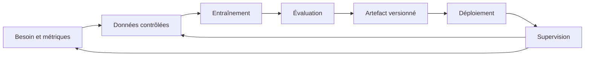

# Du modèle au système ML

Ce support accompagne les manipulations techniques qui suivent la [première séquence d'introduction](01-introduction.md). Les parties 1 à 4 servent de rappel et de transition vers l'exemple synthétique de livraison. Les manipulations sur l'environnement commencent à la partie 5.

## 1. Partir d'une décision à prendre

Une entreprise de livraison souhaite annoncer une durée estimée avant le départ d'un véhicule. Une mauvaise estimation peut provoquer une attente inutile ou une promesse difficile à tenir. Le besoin n'est donc pas simplement de produire un nombre : il faut préciser à quel moment il sera calculé, avec quelles informations et comment il sera utilisé.

Pour cette introduction, on suppose que la distance planifiée et le nombre d'arrêts sont connus au départ. La durée réelle devient disponible à l'arrivée. Nous cherchons une fonction qui associe les deux premières informations à une estimation de la troisième.

| Élément | Définition dans notre exemple |
|---|---|
| Utilisateur | Une personne qui prépare une livraison |
| Moment de prédiction | Avant le départ |
| Entrées | Distance planifiée en kilomètres, nombre d'arrêts prévus |
| Cible | Durée observée en minutes |
| Sortie | Estimation de durée |
| Comparaison initiale | Toujours annoncer la durée moyenne d'entraînement |

La durée réelle ne peut pas être une entrée : elle n'existe pas au moment où la prédiction est demandée. La distance réellement parcourue peut également différer de la distance planifiée. Ces questions de disponibilité des données précèdent le choix de l'algorithme.

**Question de départ.** Si l'on dispose d'un excellent score sur des données historiques, quelles informations manquent encore pour décider d'utiliser le modèle ? Identifier au moins un problème de données, un problème technique et un problème d'usage.

## 2. Modèle, pipeline et service

Un **modèle** contient des paramètres appris à partir de données. Pour une régression linéaire, une estimation peut s'écrire :

```text
durée estimée = constante + coefficient_distance × distance + coefficient_arrêts × arrêts
```

L'entraînement recherche les coefficients. L'inférence applique les coefficients appris à une nouvelle entrée. Réentraîner à chaque demande de prédiction serait une autre opération, plus coûteuse et difficile à contrôler.

Un **pipeline d'entraînement** organise les étapes nécessaires pour produire un modèle : lecture, contrôle, séparation des données, préparation, apprentissage, évaluation et sauvegarde. Une étape peut échouer. Il faut alors savoir ce qui a déjà été produit et ce qui doit être repris.

Un **pipeline de transformation et de prédiction** rassemble les transformations apprises et l'estimateur. Dans notre code, `make_pipeline(StandardScaler(), Ridge(...))` conserve ces deux éléments ensemble. Ce pipeline scikit-learn n'est pas à lui seul un orchestrateur : il ne gère pas la planification, les reprises de tâches distantes ou la livraison.

Un **service ML** ajoute un mode d'accès et des règles d'exploitation : format de requête, validation, disponibilité, version, journalisation et traitement des erreurs. Un fichier de modèle sauvegardé constitue un artefact ; il ne constitue pas encore un service utilisable par un client.

Le **MLOps** organise les pratiques qui permettent de construire, livrer et exploiter ce système dans le temps. Plusieurs métiers interviennent : domaine métier, données, modélisation, développement et exploitation. Une petite équipe peut cumuler ces rôles, mais les responsabilités doivent rester explicites.

## 3. Le cycle de vie et ses preuves



Une flèche représente un passage avec une condition de réussite. Avant l'entraînement, les colonnes doivent avoir une signification et un domaine de validité. Avant une livraison, le candidat doit satisfaire les contrôles retenus. Après le déploiement, le système doit continuer à produire des mesures exploitables.

| Étape | Question | Preuve possible |
|---|---|---|
| Besoin | Que doit améliorer le système ? | Critère métier et règle de référence |
| Données | Qu'a-t-on réellement utilisé ? | Schéma, provenance, empreinte du fichier |
| Entraînement | Comment a été produit le modèle ? | Code, paramètres, versions et journal |
| Évaluation | Sur quelles observations juge-t-on le résultat ? | Séparation documentée et métriques |
| Livraison | Quel modèle est utilisé ? | Identifiant d'artefact et tests |
| Exploitation | Fonctionne-t-il encore correctement ? | Mesures, alertes et procédure d'incident |

**Activité A.** Un collègue vous transmet `modele_final_v3.joblib` et indique « l'erreur est de 3 ». Écrire cinq questions qui permettent de comprendre ce résultat. Associer chaque question à une preuve du tableau. L'objectif est de passer d'un nom de fichier à une expérience explicable.

## 4. Pourquoi le code seul ne suffit pas

Dans un programme classique, une modification du code peut changer le comportement. Dans un système ML, un nouveau jeu de données peut aussi changer le modèle alors que le code reste identique. Les paramètres, l'ordre des opérations, l'aléatoire et les bibliothèques interviennent également.

Pour retrouver une expérience, nous conserverons quatre ensembles :

- le code exécuté et sa version ;
- les données effectivement utilisées et leur découpage ;
- les paramètres de l'entraînement et les graines aléatoires ;
- les versions de Python et des dépendances.

Une empreinte SHA-256 permet de comparer le contenu de deux fichiers. Elle ne prouve ni leur qualité ni leur provenance. Une graine aléatoire aide à retrouver un tirage, mais elle ne garantit pas des résultats identiques sur tous les matériels et toutes les bibliothèques.

Dans le TP, le générateur possède une graine fixe de données, tandis que `--seed` contrôle uniquement la séparation entraînement/validation. Cela permet d'observer l'effet d'un changement de découpage sans confondre cet effet avec celui de nouvelles données.

Il faut également distinguer **reproduire** et **bien généraliser**. Retrouver la même erreur deux fois montre une stabilité de l'expérience dans l'environnement considéré. Cela ne montre pas que le modèle fonctionne sur une autre population ou une autre période.

## 5. Docker et Codespaces : situer chaque composant

Une image Docker rassemble des fichiers et des instructions nécessaires à l'exécution. Un conteneur est une instance en cours d'exécution de cette image, avec son propre processus et son système de fichiers. Plusieurs conteneurs peuvent utiliser la même image. Voir les définitions officielles d'une [image](https://docs.docker.com/get-started/docker-concepts/the-basics/what-is-an-image/) et d'un [conteneur](https://docs.docker.com/get-started/docker-concepts/the-basics/what-is-a-container/).

Le **Dockerfile** décrit comment construire l'image du laboratoire. Le fichier **Compose** décrit comment la lancer et quels répertoires rendre accessibles. Le client `docker` transmet les demandes au moteur Docker ; la présence du client ne prouve pas que le moteur fonctionne. La [présentation de Docker Compose](https://docs.docker.com/get-started/docker-concepts/the-basics/what-is-docker-compose/) précise cette séparation.

Notre Dockerfile part de Python 3.12, installe cinq dépendances avec des versions explicites et fixe le répertoire de travail. Notre fichier Compose monte la racine du dépôt dans `/workspace`. Le code édité est donc directement visible dans le laboratoire, et les fichiers produits dans ce répertoire restent dans le dépôt de travail après la suppression du conteneur.

```text
Poste local                       GitHub Codespaces
éditeur + terminal                navigateur + terminal distant
       |                                 |
Docker Desktop ou Engine          conteneur de développement + moteur Docker
       |                                 |
       +------- image du laboratoire ----+
                       |
             scripts Python et artefacts
```

Codespaces fournit un environnement de développement distant. Le fichier `.devcontainer/devcontainer.json` décrit celui de ce dépôt. Ici, la fonctionnalité Docker-in-Docker installe un moteur dans cet environnement pour exécuter les commandes du laboratoire. Le Python du terminal Codespaces et celui du laboratoire sont donc deux interpréteurs distincts. Nous exécutons les exercices avec `docker compose run` pour utiliser les dépendances prévues. Voir [les dev containers dans Codespaces](https://docs.github.com/en/codespaces/setting-up-your-project-for-codespaces/adding-a-dev-container-configuration/introduction-to-dev-containers).

**Lire une commande :**

```bash
docker compose run --rm lab python 01-intro/exemples/diagnostic.py
```

`run` crée un conteneur ponctuel pour le service `lab`. `--rm` supprime ce conteneur après la commande. Les arguments suivants remplacent la commande par défaut de l'image. Le montage de `/workspace` explique pourquoi les rapports du TP persistent. Aucun serveur web n'est lancé à ce stade.

**Activité B.** Suivre le guide environnement, exécuter le diagnostic et localiser chaque élément du schéma. Expliquer pourquoi installer une bibliothèque sur Windows ne l'installe pas dans l'image du laboratoire.

## 6. Une première expérience mesurable

Le jeu d'introduction comporte 500 livraisons synthétiques. La distance varie de 1 à 30 km et le nombre d'arrêts de 0 à 5. La durée est construite à partir d'une relation linéaire et d'un bruit aléatoire. Ces données sont conçues pour apprendre à manipuler une expérience, sans représenter un trafic réel.

Nous réservons 400 lignes pour l'entraînement et 100 pour la validation. Cette séparation aléatoire convient à la population synthétique indépendante utilisée ici. Des données de production ordonnées dans le temps exigeraient de réfléchir à une séparation chronologique, à la saisonnalité et aux observations liées entre elles.

La référence `DummyRegressor` apprend une durée moyenne sur l'entraînement. Elle répond à une question utile : gagne-t-on quelque chose par rapport à une estimation constante ? Le candidat est une régression Ridge, qui limite l'amplitude des coefficients par une pénalisation réglée avec `alpha`.

Le `StandardScaler` apprend moyenne et écart-type sur l'entraînement. À l'inférence, il applique ces valeurs déjà apprises. Ajuster les transformations sur tout le jeu avant la séparation utiliserait des informations de validation. La [documentation scikit-learn sur les fuites de données](https://scikit-learn.org/stable/common_pitfalls.html) recommande de séparer les données avant les traitements appris et explique l'intérêt des pipelines.

### Comprendre la métrique

La MAE est la moyenne des écarts absolus entre durée observée et durée estimée :

```text
MAE = somme des |durée observée - durée estimée| / nombre de livraisons
```

Pour des durées réelles de 20, 40 et 60 minutes et des estimations de 22, 35 et 66 minutes, les erreurs absolues valent 2, 5 et 6. La MAE vaut 13/3, soit environ 4,33 minutes. Elle garde l'unité de la cible, ce qui facilite la discussion métier.

Une MAE de 4 minutes ne signifie pas que chaque erreur est inférieure à 4 minutes. Elle ne décrit pas non plus seule les retards extrêmes, les sous-estimations ou les différences entre trajets courts et longs. Un critère de mise en service devra aller au-delà d'une moyenne.

### Lire les étapes du programme

```python
modele = make_pipeline(StandardScaler(), Ridge(alpha=alpha))
modele.fit(x[train], y[train])
predicted = modele.predict(x[validation])
```

`fit` apprend les transformations et les coefficients. `predict` utilise ce qui a été appris. Le programme sauvegarde ensuite le pipeline complet et un rapport, ce qui rend possible une prédiction dans un nouveau processus.

**Activité C.** Exécuter deux fois les mêmes paramètres, puis changer uniquement la graine de séparation. Comparer les empreintes, les indices et les métriques. Changer la graine ne constitue pas une amélioration du modèle : cela change l'échantillon sur lequel on le juge.

## 7. Utiliser le modèle et observer une erreur

L'inférence reçoit deux caractéristiques dans l'ordre attendu : distance et nombre d'arrêts. Une inversion silencieuse peut produire un nombre plausible mais incorrect. Le contrat doit donc documenter noms, unités, types et domaines autorisés.

Le script fourni refuse une distance hors de 1 à 30 km, un nombre d'arrêts hors de 0 à 5 et les nombres non finis. Cette règle est un choix pédagogique de domaine d'usage ; un modèle mathématique pourrait calculer au-delà, mais le cours ne dispose d'aucune preuve de validité dans cette zone.

**Activité D.** Recharger le modèle, prédire une livraison de 10 km avec 2 arrêts, puis envoyer une distance négative. Identifier à quelle étape intervient le refus. Expliquer pourquoi une erreur de validation est différente d'une erreur statistique de prédiction.

Un artefact `joblib` se recharge uniquement s'il provient d'une source de confiance : ce format peut exécuter du code au chargement. Dans ce TP, utiliser uniquement le fichier que vous venez de produire. La [documentation de persistance scikit-learn](https://scikit-learn.org/stable/model_persistence.html) décrit cette contrainte et les dépendances de version.

## 8. Maturité et prochaine étape

On peut décrire notre progression pédagogique par trois situations, sans en faire une norme universelle :

| Situation | Ce qui existe | Prochaine amélioration utile |
|---|---|---|
| Expérience manuelle | Résultats et modèle sur un poste | Rendre les étapes rejouables |
| Expérience reproductible | Script, données, paramètres, environnement et rapport | Centraliser et comparer les expériences |
| Chaîne exploitée | Contrôles, livraison, supervision et reprise | Adapter l'automatisation au besoin réel |

Automatiser une chaîne dont les données et critères sont mal définis permet surtout de reproduire plus vite ses problèmes. Commencer avec une référence simple rend les améliorations mesurables ; les [règles de ML de Google](https://developers.google.com/machine-learning/guides/rules-of-ml) soulignent cette importance de la simplicité initiale et de l'infrastructure.

À la fin de l'introduction, nous avons un script, un environnement et des rapports locaux. Comparer vingt essais en ouvrant vingt fichiers deviendra laborieux. Le chapitre suivant introduira le suivi des expériences avec MLflow, à partir de ce besoin concret.

**Restitution individuelle.** En cinq phrases : expliquer la référence, citer deux éléments nécessaires à la reproduction, distinguer image et conteneur, décrire une erreur observée et nommer une limite empêchant une mise en production immédiate. Le mini-projet du cours sera défini séparément de ce jeu synthétique.
