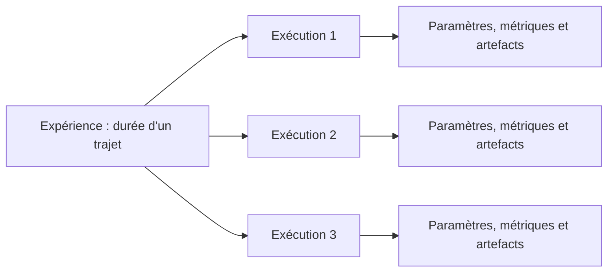

# Introduction au suivi des expériences

En machine learning, un premier modèle est rarement le modèle retenu. Vous modifiez les données, les variables, l'algorithme ou ses paramètres, puis vous mesurez le résultat obtenu.

Sans suivi structuré, il devient difficile de répondre à une question simple : **quelle configuration a produit ce résultat ?**

## Une expérience et ses exécutions

Une **expérience** regroupe les essais réalisés pour répondre à un même objectif. Dans notre cas, l'objectif est de prédire la durée d'un trajet en taxi.

Chaque essai constitue une **exécution**, également appelée *run*. Une exécution conserve les informations associées à un entraînement.

## Informations à enregistrer

Une exécution peut contenir :

| Élément | Rôle | Exemple |
| --- | --- | --- |
| **Paramètre** | Décrit la configuration choisie avant l'entraînement | valeur de `alpha`, mois d'entraînement |
| **Métrique** | Mesure le résultat obtenu | RMSE sur les données de validation |
| **Métadonnée** | Facilite l'identification de l'exécution | nom de l'algorithme, auteur, version du code |
| **Artefact** | Conserve un fichier produit | modèle entraîné, graphique, rapport |

Le suivi doit aussi permettre d'identifier les données et le code utilisés. Deux exécutions ne sont comparables que si leur contexte est connu.

## Pourquoi suivre les expériences

Le suivi des expériences répond à trois besoins :

1. **Reproduire** un résultat à partir de sa configuration.
2. **Comparer** plusieurs essais avec les mêmes critères.
3. **Justifier** le choix d'un modèle à partir de résultats observables.

Un tableau ou un nom de fichier peut suffire pour quelques essais. Cette méthode devient fragile lorsque le nombre d'exécutions augmente ou que plusieurs personnes travaillent sur le même projet.

## Position dans le modèle de maturité

Ce TP prépare le **niveau 2, entraînement automatisé**, du [modèle de maturité MLOps de Microsoft](https://learn.microsoft.com/fr-fr/azure/architecture/ai-ml/guide/mlops-maturity-model). À ce niveau, l'entraînement devient reproductible et ses paramètres, métriques et modèles sont suivis.

L'enregistrement d'une expérience dans MLflow constitue une étape vers ce niveau. Il faudra également transformer le notebook en processus d'entraînement rejouable pour atteindre réellement ce degré de maturité.

## Le rôle de MLflow

MLflow organise les exécutions au sein d'expériences. Il permet d'enregistrer les paramètres, les métriques et les artefacts, puis de comparer les résultats dans une interface.

Dans ce TP, MLflow fonctionnera d'abord sur votre environnement local ou dans Codespaces. Chaque entraînement produira une exécution consultable.

## Première analyse

Pour un modèle qui prédit la durée d'un trajet, classez les éléments suivants dans la bonne catégorie :

- le mois utilisé pour l'entraînement ;
- la valeur de la RMSE ;
- le modèle enregistré dans un fichier ;
- la valeur d'un hyperparamètre ;
- la version du code exécuté.

Repérez ensuite les informations qui seraient nécessaires pour reproduire exactement l'entraînement.

## À retenir

Une expérience regroupe plusieurs exécutions. Chaque exécution associe une configuration à des résultats et à des fichiers produits. Le suivi rend les essais comparables, reproductibles et compréhensibles.

## Préparer le TP suivant

Consultez le [guide de démarrage rapide de MLflow](https://mlflow.org/docs/latest/ml/getting-started/quickstart/). Repérez comment créer une exécution, enregistrer des paramètres et des métriques, puis consulter les résultats dans l'interface MLflow.
