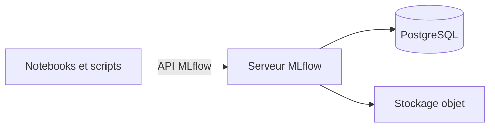

# TP 02 : démarrer le suivi avec MLflow

Vous allez observer trois façons d'utiliser MLflow. Les deux premières seront réalisées dans le TP. La troisième sera étudiée comme une architecture destinée au travail en équipe.

| Scénario | Serveur de suivi | Métadonnées | Artefacts |
| --- | --- | --- | --- |
| 1. Travail individuel | Aucun | Fichiers locaux | Fichiers locaux |
| 2. Serveur local | MLflow sur la machine | SQLite | Fichiers locaux |
| 3. Serveur distant | MLflow sur une infrastructure partagée | PostgreSQL | Stockage objet partagé |

## 1. Installer MLflow

Depuis la racine du dépôt `learning-mlops`, ouvrez un terminal et exécutez :

```bash
conda activate mlops
python -m pip install mlflow
mlflow --version
```

Ajoutez ensuite ces lignes dans `.gitignore` :

```gitignore
mlflow.db
mlruns/
mlartifacts/
```

## 2. Scénario 1 : suivre une expérience localement

Ce premier scénario convient à une personne qui travaille seule. Il n'utilise aucun serveur de suivi. MLflow écrit les informations et les artefacts dans le dossier local `mlruns`.

Ouvrez `05-duration-prediction.ipynb`. Après les imports, ajoutez :

```python
import mlflow

print(mlflow.get_tracking_uri())
```

Sans configuration supplémentaire, MLflow utilise son stockage local par défaut.

Sélectionnez ensuite une expérience :

```python
mlflow.set_experiment("nyc-taxi-duration")
```

MLflow crée l'expérience si elle n'existe pas.

## 3. Enregistrer une exécution

Après l'entraînement des modèles du TP 05, copiez cette cellule :

```python
with mlflow.start_run():
    mlflow.set_tag("task", "taxi-duration-prediction")
    mlflow.log_param("model", selected_name)
    mlflow.log_param("sample_size", sample_size)
    mlflow.log_param("validation_ratio", 0.2)
    mlflow.log_metric("validation_rmse", selected_rmse)

    mlflow.sklearn.log_model(
        sk_model=selected_model,
        artifact_path="model",
    )
```

Le bloc `mlflow.start_run()` ouvre une nouvelle exécution et la ferme à la fin du bloc `with`.

Les appels utilisés dans ce bloc ont chacun un rôle :

- `set_tag` ajoute une information descriptive ;
- `log_param` enregistre une valeur choisie avant l'entraînement ;
- `log_metric` enregistre un résultat mesuré ;
- `log_model` conserve le modèle comme artefact.

## 4. Consulter le stockage local

Dans un terminal ouvert à la racine du dépôt, exécutez :

```bash
mlflow ui --host 0.0.0.0 --port 5000
```

Avec Anaconda en local, ouvrez [http://127.0.0.1:5000](http://127.0.0.1:5000).

Dans Codespaces, ouvrez l'onglet **PORTS**, puis l'adresse du port `5000`. Conservez la visibilité sur **Private**.

Retrouvez l'expérience `nyc-taxi-duration`, ses paramètres, sa métrique et son modèle.

Arrêtez ensuite l'interface avec `Ctrl + C`.

## 5. Limites du scénario 1

Les données de suivi restent dans le dossier de travail. Elles ne sont pas centralisées et le registre de modèles n'est pas disponible avec ce stockage par fichiers. Cette configuration suffit pour une expérimentation individuelle, mais elle devient difficile à partager.

## 6. Scénario 2 : utiliser un serveur local et SQLite

Le deuxième scénario sépare le notebook du service de suivi. Le serveur MLflow reçoit les informations et les enregistre dans une base SQLite. Les artefacts restent sur le système de fichiers local.

Dans un terminal ouvert à la racine du dépôt, exécutez :

```bash
mlflow server \
  --host 0.0.0.0 \
  --port 5000 \
  --backend-store-uri sqlite:///mlflow.db \
  --serve-artifacts \
  --artifacts-destination ./mlartifacts
```

Gardez ce terminal ouvert.

Dans le notebook, remplacez la configuration initiale par :

```python
import mlflow

mlflow.set_tracking_uri("http://127.0.0.1:5000")
mlflow.set_experiment("nyc-taxi-duration")

print(mlflow.get_tracking_uri())
```

`set_tracking_uri` indique maintenant au client MLflow d'envoyer les informations au serveur local.

## 7. Le bloc `mlflow.start_run()` ne change pas

Reprenez sans modification la cellule de la partie 3 :

```python
with mlflow.start_run():
    mlflow.set_tag("task", "taxi-duration-prediction")
    mlflow.log_param("model", selected_name)
    mlflow.log_param("sample_size", sample_size)
    mlflow.log_param("validation_ratio", 0.2)
    mlflow.log_metric("validation_rmse", selected_rmse)

    mlflow.sklearn.log_model(
        sk_model=selected_model,
        artifact_path="model",
    )
```

Le code de suivi ne dépend pas du lieu de stockage. La configuration placée avant l'exécution détermine où MLflow envoie les paramètres, les métriques et les artefacts.

Actualisez l'interface. La nouvelle exécution est maintenant enregistrée dans `mlflow.db` et ses artefacts dans `mlartifacts`.

## 8. Ce que le scénario 2 apporte

SQLite structure les métadonnées et permet d'utiliser les fonctions de registre de modèles. Un client MLflow peut interroger le serveur au lieu de lire directement un dossier local.

Cette installation reste limitée à la machine qui exécute le serveur. Elle convient au TP et à un développement local.

## 9. Scénario 3 : serveur distant partagé

Ce scénario est présenté comme documentation. Il ne sera pas mis en place dans ce TP.

Une équipe peut déployer MLflow sur un serveur distant et remplacer les composants locaux par des services partagés :



- le serveur MLflow fournit une adresse commune à tous les utilisateurs ;
- PostgreSQL conserve les expériences, les exécutions, les paramètres et les métriques ;
- un stockage objet, comme Amazon S3, conserve les modèles et les autres artefacts ;
- les droits d'accès et les secrets doivent être gérés par l'infrastructure.

Le client changerait uniquement son adresse de suivi pour utiliser l'URL du serveur distant. Le bloc `mlflow.start_run()` resterait identique.

Cette architecture facilite le partage, mais demande une base de données, un stockage d'artefacts, un réseau sécurisé, des sauvegardes et une gestion des accès.

## 10. Exercice : retrouver une exécution existante

Réalisez cet exercice avec le serveur local et SQLite. N'ajoutez pas un nouvel entraînement uniquement pour récupérer le modèle : utilisez une exécution déjà enregistrée.

### Travail demandé

1. Lancez une nouvelle exécution de l'entraînement et enregistrez les chemins de tous les fichiers Parquet utilisés.
2. Associez chaque chemin à un nom explicite afin de distinguer les données d'entraînement et de validation.
3. Ajoutez le nom du modèle, ses principaux paramètres et sa RMSE de validation.
4. Retrouvez dans l'interface une exécution qui contient déjà un modèle enregistré.


### Résultat attendu

Présentez l'exécution dans l'interface MLflow et montrez :

- les chemins des fichiers utilisés ;
- les paramètres et la métrique enregistrés ;
- l'identifiant de l'exécution sélectionnée ;
- le modèle retrouvé dans les artefacts ;
- le résultat d'une prédiction réalisée avec le modèle rechargé.

### Conseils

- Utilisez des noms de paramètres stables, par exemple `train_data_path` et `validation_data_path`.
- Si un même fichier sert avant une séparation interne, enregistrez son chemin comme source, puis décrivez la règle de séparation dans un paramètre distinct.
- Un chemin indique où se trouve un fichier, mais ne garantit pas que son contenu est resté identique. Une empreinte du fichier pourra compléter cette information.
- Copiez l'identifiant de l'exécution depuis l'interface MLflow afin d'éviter une erreur de saisie.
- L'URI d'un modèle associé à une exécution commence par `runs:/` et se termine par le chemin de son artefact.
- Utilisez le chargeur correspondant au format enregistré. Un modèle enregistré avec la saveur scikit-learn peut être chargé avec les fonctions MLflow prévues pour scikit-learn.
- Le modèle du TP attend une matrice déjà transformée. Réutilisez le même `DictVectorizer` et le même ordre de variables.
- Vérifiez que le serveur utilisé pour charger le modèle est celui qui contient l'exécution choisie.

## 11. Vérification

À la fin du TP, expliquez :

1. où sont conservées les données dans chaque scénario ;
2. pourquoi le scénario 1 ne nécessite aucun serveur ;
3. ce que SQLite apporte au scénario 2 ;
4. pourquoi le bloc `mlflow.start_run()` reste identique ;
5. pourquoi le scénario 3 n'est pas réalisé dans ce TP.

Sources techniques : [MLflow Tracking](https://mlflow.org/docs/latest/ml/tracking/) et [MLflow Tracking Server](https://mlflow.org/docs/latest/self-hosting/architecture/tracking-server/).
