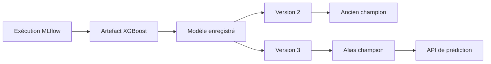

# Étape 03 : gestion et registre des modèles

Le suivi des expériences conserve les essais. La gestion des modèles commence lorsqu'il faut sélectionner un résultat, conserver sa traçabilité et préparer son utilisation par une autre étape du système.

## 1. Distinguer artefact, modèle enregistré et déploiement

| Élément | Rôle | Exemple Yellow Taxi |
| --- | --- | --- |
| **Artefact de modèle** | Fichier produit par une exécution et conservé avec ses paramètres et métriques | Le modèle XGBoost obtenu par une exécution dont la RMSE de validation vaut 5,2 minutes |
| **Modèle enregistré** | Nom stable qui regroupe plusieurs versions dans le registre MLflow | `nyc-taxi-duration-model` regroupe tous les modèles retenus pour prédire la durée |
| **Version de modèle** | Version liée à l'exécution qui a produit l'artefact | La version 1 pointe vers un modèle linéaire, tandis que la version 2 pointe vers un modèle XGBoost |
| **Alias** | Nom attribué à une version pour indiquer son rôle | `champion` désigne la version 2 actuellement retenue et `challenger` désigne la version 3 en cours d'évaluation |
| **Déploiement** | Processus qui rend une version utilisable par une application | Une API charge le modèle associé à `champion` et retourne une durée estimée pour un nouveau trajet |

Le registre organise les versions et leurs métadonnées. Il ne déploie pas lui-même le modèle.

Prenons une exécution concrète. Le fichier de mai 2026 est utilisé pour entraîner un modèle XGBoost avec `max_depth=6`. MLflow enregistre une RMSE de 5,2 minutes et conserve le modèle comme artefact. Après comparaison avec les autres exécutions, cet artefact est ajouté au registre sous le nom `nyc-taxi-duration-model`. MLflow lui attribue la version 2, puis l'alias `champion` indique qu'il s'agit de la version retenue.

Une nouvelle expérience produit ensuite une version 3 avec une RMSE de 5,0 minutes. Cette version peut recevoir l'alias `challenger` pendant sa vérification. Si elle respecte tous les critères, l'alias `champion` peut être déplacé de la version 2 vers la version 3. La version 2 reste disponible pour revenir en arrière.



L'alias facilite donc la sélection d'une version. Il ne démarre pas l'API et ne copie pas automatiquement le modèle vers un environnement de production.

## 2. Position dans le modèle de maturité

Cette étape reste au **niveau 2, entraînement automatisé**. Les expériences et les modèles deviennent traçables et reproductibles. Le registre prépare le niveau 3, mais celui-ci exige également un processus de déploiement automatisé.

## 3. Prérequis

Utilisez le scénario 2 du TP précédent. Le serveur MLflow doit fonctionner avec SQLite :

```bash
conda activate mlops
mlflow server \
  --host 0.0.0.0 \
  --port 5000 \
  --backend-store-uri sqlite:///mlflow.db \
  --serve-artifacts \
  --artifacts-destination ./mlartifacts
```

Le registre nécessite un backend de base de données. Le stockage local par fichiers du scénario 1 ne suffit pas pour cette partie.

## 4. Connecter le client MLflow

Créez le notebook `03-modele-registry-management.ipynb` à la racine du dépôt. Copiez cette première cellule :

```python
import mlflow
from mlflow.tracking import MlflowClient

tracking_uri = "http://127.0.0.1:5000"
experiment_name = "nyc-taxi-duration"
registered_model_name = "nyc-taxi-duration-model"

mlflow.set_tracking_uri(tracking_uri)
client = MlflowClient(tracking_uri=tracking_uri)
```

Le client permet d'interroger les expériences et de gérer les objets du registre.

Listez les expériences disponibles :

```python
experiments = client.search_experiments()

for experiment in experiments:
    print(experiment.experiment_id, experiment.name)
```

Cette vérification permet de retrouver l'identifiant associé à `nyc-taxi-duration` avant de rechercher ses exécutions.

## 5. Retrouver la meilleure exécution

Sélectionnez l'exécution dont la RMSE de validation est la plus faible :

```python
experiment = mlflow.get_experiment_by_name(experiment_name)

if experiment is None:
    raise ValueError(f"Expérience introuvable : {experiment_name}")

runs = mlflow.search_runs(
    experiment_ids=[experiment.experiment_id],
    filter_string="attributes.status = 'FINISHED'",
    order_by=["metrics.validation_rmse ASC"],
    max_results=5,
)

if runs.empty:
    raise ValueError("Aucune exécution terminée n'a été trouvée")

best_run = runs.iloc[0]
runs[["run_id", "params.model", "metrics.validation_rmse"]]
```

Le classement place la RMSE la plus faible sur la première ligne. `best_run` représente donc la meilleure exécution parmi les résultats retournés. Cette sélection suppose que toutes les exécutions ont utilisé le même protocole de validation.

Vous pouvez compléter `filter_string` pour limiter la recherche à un modèle, un tag ou un seuil de métrique. Utilisez uniquement des informations réellement enregistrées dans les exécutions.

## 6. Enregistrer une version du modèle

Récupérez l'identifiant de l'exécution, puis créez une version dans le registre :

```python
run_id = best_run["run_id"]
model_uri = f"runs:/{run_id}/model"

model_version = mlflow.register_model(
    model_uri=model_uri,
    name=registered_model_name,
)

model_version.version
```

MLflow crée le modèle enregistré s'il n'existe pas. Les enregistrements suivants créent de nouvelles versions sous le même nom.

Listez les versions associées à ce nom :

```python
versions = client.search_model_versions(
    filter_string=f"name = '{registered_model_name}'"
)

for item in versions:
    print(
        "version:", item.version,
        "run:", item.run_id,
        "status:", item.status,
    )
```

Chaque version doit pointer vers l'exécution qui a produit son artefact.

## 7. Documenter la version

Ajoutez une description et des informations utiles :

```python
version = model_version.version

client.update_model_version(
    name=registered_model_name,
    version=version,
    description="Modèle candidat pour la prédiction de durée des trajets Yellow Taxi.",
)

client.set_model_version_tag(
    name=registered_model_name,
    version=version,
    key="validation_status",
    value="reviewed",
)
```

La description explique l'usage prévu. Les tags ajoutent des informations structurées pour rechercher ou contrôler une version.

## 8. Attribuer un alias

Les anciens stages MLflow sont dépréciés. Utilisez un alias pour désigner le rôle actuel d'une version :

```python
client.set_registered_model_alias(
    name=registered_model_name,
    alias="champion",
    version=version,
)
```

L'alias `champion` désigne ici la version retenue. Un alias `challenger` peut identifier une nouvelle version à comparer. Déplacer un alias ne supprime pas les anciennes versions.

Retrouvez la version actuellement désignée par l'alias :

```python
champion_version = client.get_model_version_by_alias(
    name=registered_model_name,
    alias="champion",
)

champion_version.version, champion_version.run_id
```

## 9. Charger le modèle avec son alias

Copiez :

```python
champion_uri = f"models:/{registered_model_name}@champion"
champion_model = mlflow.sklearn.load_model(champion_uri)

champion_predictions = champion_model.predict(X_val[:5])
champion_predictions
```

Cette cellule suppose que `X_val` existe dans le notebook. Vous pouvez reprendre les cellules de préparation du TP 05 avant de charger le modèle.

L'URI fondée sur l'alias reste stable lorsque l'alias est attribué à une nouvelle version. Le code consommateur n'a donc pas besoin de connaître le numéro exact de la version.

## 10. Parcourir le registre et récupérer un artefact

Listez les modèles enregistrés :

```python
registered_models = client.search_registered_models()

for model in registered_models:
    print(model.name)
```

Téléchargez ensuite l'artefact associé à l'exécution sélectionnée :

```python
download_path = client.download_artifacts(
    run_id=run_id,
    path="model",
    dst_path="downloaded-artifacts",
)

download_path
```

Cette manipulation crée une copie locale de l'artefact. Le chargement avec une URI `models:/` permet généralement d'utiliser directement la version du registre sans gérer ce chemin manuellement.

## 11. Vérifier la traçabilité

Dans l'interface MLflow, ouvrez **Models**, puis `nyc-taxi-duration-model`. Vérifiez que la version présente :

1. un lien vers l'exécution source ;
2. la RMSE de validation de cette exécution ;
3. la description de la version ;
4. le tag `validation_status` ;
5. l'alias `champion`.

La version doit permettre de revenir aux paramètres, aux données référencées et à l'artefact produits pendant l'entraînement.

## 12. Exercice : gérer et comparer une nouvelle version

Réalisez l'exercice sans supprimer la version existante :

1. choisissez une autre exécution terminée contenant un modèle ;
2. enregistrez son artefact sous le même nom de modèle ;
3. ajoutez une description et le tag `validation_status` ;
4. attribuez-lui l'alias `challenger` ;
5. retrouvez les versions liées aux alias `champion` et `challenger` avec le client MLflow ;
6. chargez les deux modèles avec leurs URI fondées sur les alias ;
7. calculez leur RMSE sur le même jeu de validation ;
8. déplacez l'alias `champion` uniquement si la nouvelle version respecte votre règle de sélection ;
9. rechargez le modèle désigné par `champion` et vérifiez son numéro de version.

### Conseils

- Vérifiez que l'exécution contient bien l'artefact `model` avant de l'enregistrer.
- Comparez des métriques calculées sur le même jeu de validation.
- Utilisez la description pour expliquer la décision, pas seulement pour répéter le nom du modèle.
- Conservez l'ancienne version afin de permettre un retour en arrière.
- Le déplacement d'un alias modifie une référence dans le registre. Il ne déploie pas le modèle.
- Un tag peut être partagé par plusieurs versions. Un alias donné ne pointe que vers une version à la fois pour un même modèle enregistré.

## 13. À retenir

Une exécution conserve la preuve d'un entraînement. Le registre associe l'artefact retenu à un nom, une version, des métadonnées et un alias. Cette organisation permet à une étape de déploiement de récupérer une version explicite sans perdre sa traçabilité.

Sources techniques : [MLflow Model Registry](https://mlflow.org/docs/latest/ml/model-registry/) et [MLflow Model Registry workflows](https://mlflow.org/docs/latest/ml/model-registry/workflow/).
