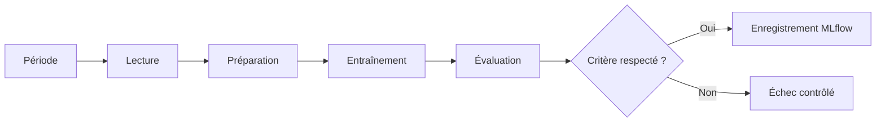

# TP 03 : du notebook au workflow orchestré

Ce support réunit l'introduction à l'orchestration, la conversion du notebook en projet Python et la préparation du workflow orchestré.

## Partie 1 : comprendre l'orchestration

Le script d'entraînement peut être exécuté depuis un terminal. Un orchestrateur ajoute la gestion du workflow : paramètres, dépendances, planification, reprises et historique des exécutions.

### Du script au workflow

Le workflow de prédiction de durée contient plusieurs étapes :

1. sélectionner la période de données ;
2. lire et contrôler les fichiers ;
3. préparer les variables ;
4. entraîner le modèle ;
5. évaluer le résultat ;
6. enregistrer l'expérience et le modèle dans MLflow ;
7. attribuer un alias après validation.



### Notions principales

| Notion | Exemple dans le TP |
| --- | --- |
| **Workflow** | Ensemble du traitement, de la lecture des trajets à l'enregistrement du modèle |
| **Tâche** | Étape isolée comme lire les données ou calculer la RMSE |
| **Dépendance** | L'entraînement commence uniquement après la préparation des variables |
| **Paramètre** | Année, mois, taille de l'échantillon ou seuil de validation |
| **Exécution** | Lancement du workflow avec une configuration précise |
| **Nouvelle tentative** | Relance d'une tâche après un échec temporaire |
| **Backfill** | Exécution du même workflow sur plusieurs périodes historiques |

### Rôle des composants

- Le **script Python** contient la logique de traitement et d'entraînement.
- L'**orchestrateur** décide quand et dans quel ordre exécuter les tâches.
- **MLflow** conserve les paramètres, métriques, artefacts et versions de modèles.
- Le **service de prédiction** charge une version validée pour répondre aux requêtes.

Ces composants coopèrent, mais ne remplissent pas le même rôle. MLflow ne planifie pas le workflow et l'orchestrateur ne remplace pas le registre des modèles.

### Choisir un orchestrateur

Des outils comme [Apache Airflow](https://airflow.apache.org/docs/apache-airflow/stable/index.html), Prefect, Dagster, Kestra ou Mage permettent de gérer des workflows. La documentation officielle d'Airflow présente son fonctionnement, ses workflows et ses principaux composants. Le choix dépend de l'environnement d'exécution, du mode de déploiement et des besoins de l'équipe.

Dans ce TP, l'outil retenu devra au minimum permettre de définir des tâches, transmettre des paramètres, afficher les journaux et relancer une exécution en échec.

### Première analyse

Pour chaque situation, indiquez si elle relève du script, de l'orchestrateur ou de MLflow :

1. calculer la durée d'un trajet ;
2. relancer une lecture après une indisponibilité temporaire ;
3. enregistrer la RMSE ;
4. exécuter le workflow pour mai 2026 ;
5. retrouver le modèle portant l'alias `champion`.

Source d'organisation : [Using an Orchestrator](https://github.com/DataTalksClub/mlops-zoomcamp/blob/main/03-orchestration/03-orchestrator.md).

## Partie 2 : passer du notebook au projet Python

Le notebook facilite l'exploration, mais son résultat dépend de l'ordre d'exécution des cellules et des variables présentes en mémoire. Un workflow orchestré a besoin d'un programme qui reçoit des entrées explicites et peut être lancé depuis un terminal.

Vous allez convertir `05-duration-prediction.ipynb` en un petit projet Python installable.

### 1. Identifier les responsabilités du notebook

Avant de copier du code, regroupez les cellules selon leur rôle :

1. lire et contrôler les données ;
2. calculer la durée et préparer les variables ;
3. séparer entraînement et validation ;
4. choisir et entraîner un modèle ;
5. calculer la RMSE ;
6. enregistrer l'exécution et le modèle dans MLflow.

Chaque groupe deviendra une fonction. Une fonction doit recevoir les données dont elle dépend et retourner son résultat.

### 2. Créer la structure du projet

Depuis la racine de `learning-mlops`, créez cette structure :

```text
learning-mlops/
├── data/
│   └── yellow_tripdata_2026-05.parquet
├── src/
│   └── learning_mlops/
│       ├── __init__.py
│       └── train.py
├── .gitignore
├── pyproject.toml
└── README.md
```

Dans Codespaces, WSL, macOS ou Linux, exécutez :

```bash
mkdir -p src/learning_mlops
touch src/learning_mlops/__init__.py
touch src/learning_mlops/train.py
touch pyproject.toml
```

Le dossier `src` sépare le code Python des données et des fichiers de configuration. Le fichier `__init__.py` indique que `learning_mlops` est un package Python.

### 3. Décrire le projet avec `pyproject.toml`

Copiez dans `pyproject.toml` :

```toml
[build-system]
requires = ["setuptools>=68"]
build-backend = "setuptools.build_meta"

[project]
name = "learning-mlops"
version = "0.1.0"
description = "Entrainement du modele de duree des trajets"
requires-python = ">=3.10"
dependencies = [
    "mlflow",
    "pandas",
    "pyarrow",
    "scikit-learn",
    "xgboost",
]

[project.scripts]
train-taxi-model = "learning_mlops.train:main"

[tool.setuptools.packages.find]
where = ["src"]
```

La section `dependencies` décrit les bibliothèques nécessaires. La section `project.scripts` crée la commande `train-taxi-model` et la relie à la fonction `main` du fichier `train.py`.

Installez le projet dans l'environnement `mlops` :

```bash
conda activate mlops
python -m pip install -e .
```

L'option `-e` installe le projet en mode éditable. Une modification du code source est alors disponible sans réinstaller le package.

### 4. Ajouter les imports

Ouvrez `src/learning_mlops/train.py` et commencez par copier :

```python
import argparse
from pathlib import Path

import mlflow
import mlflow.sklearn
import pandas as pd
from sklearn.feature_extraction import DictVectorizer
from sklearn.linear_model import Lasso, LinearRegression
from sklearn.metrics import root_mean_squared_error
from sklearn.pipeline import make_pipeline
from xgboost import XGBRegressor
```

Le script ne contient aucun import propre à Jupyter. Il doit fonctionner avec l'interpréteur Python standard.

### 5. Créer la fonction de lecture

Ajoutez sous les imports :

```python
def read_data(data_path: Path, sample_size: int) -> pd.DataFrame:
    if not data_path.exists():
        raise FileNotFoundError(f"Fichier introuvable : {data_path}")

    df = pd.read_parquet(data_path)

    required_columns = {
        "tpep_pickup_datetime",
        "tpep_dropoff_datetime",
        "PULocationID",
        "DOLocationID",
        "trip_distance",
    }
    missing_columns = required_columns.difference(df.columns)

    if missing_columns:
        raise ValueError(f"Colonnes absentes : {sorted(missing_columns)}")

    df["duration"] = (
        df["tpep_dropoff_datetime"] - df["tpep_pickup_datetime"]
    ).dt.total_seconds() / 60

    df = df[df["duration"].between(1, 60)].copy()

    if df.empty:
        raise ValueError("Aucun trajet valide après le filtrage")

    selected_size = min(sample_size, len(df))
    df = df.sample(n=selected_size, random_state=42)
    return df.sort_values("tpep_pickup_datetime").reset_index(drop=True)
```

Cette fonction rend les contrôles explicites. Elle arrête le programme si le fichier, les colonnes ou les trajets valides manquent.

### 6. Créer la fonction de préparation

Ajoutez :

```python
def prepare_data(df: pd.DataFrame):
    categorical = ["PULocationID", "DOLocationID"]
    df[categorical] = df[categorical].astype(str)
    df["PU_DO"] = df["PULocationID"] + "_" + df["DOLocationID"]

    features = ["PU_DO", "trip_distance"]
    split_index = int(len(df) * 0.8)

    if split_index == 0 or split_index == len(df):
        raise ValueError("Données insuffisantes pour créer les deux jeux")

    train_records = df.iloc[:split_index][features].to_dict(orient="records")
    validation_records = df.iloc[split_index:][features].to_dict(orient="records")
    y_train = df.iloc[:split_index]["duration"].to_numpy()
    y_validation = df.iloc[split_index:]["duration"].to_numpy()

    return train_records, validation_records, y_train, y_validation
```

La fonction retourne uniquement ce dont l'entraînement a besoin. Elle ne dépend pas de variables créées ailleurs.

### 7. Créer la fonction de sélection du modèle

Ajoutez :

```python
def build_model(model_name: str, alpha: float):
    if model_name == "linear":
        return LinearRegression()
    if model_name == "lasso":
        return Lasso(alpha=alpha, max_iter=10_000)
    if model_name == "xgboost":
        return XGBRegressor(
            n_estimators=100,
            max_depth=6,
            learning_rate=0.1,
            objective="reg:squarederror",
            random_state=42,
            n_jobs=-1,
        )

    raise ValueError(f"Modèle inconnu : {model_name}")
```

Le nom du modèle devient une entrée du programme. Il n'est plus nécessaire de modifier le fichier pour changer d'algorithme.

### 8. Réunir transformation et modèle

Dans le notebook, `DictVectorizer` et le modèle étaient sauvegardés séparément avec `pickle`. Le projet utilise un pipeline scikit-learn qui contient les deux objets.

Ajoutez la fonction principale d'entraînement :

```python
def run_training(
    data_path: Path,
    model_name: str,
    alpha: float,
    sample_size: int,
    tracking_uri: str,
    experiment_name: str,
) -> float:
    mlflow.set_tracking_uri(tracking_uri)
    mlflow.set_experiment(experiment_name)

    df = read_data(data_path, sample_size)
    train_records, validation_records, y_train, y_validation = prepare_data(df)

    estimator = build_model(model_name, alpha)
    pipeline = make_pipeline(DictVectorizer(), estimator)

    with mlflow.start_run():
        mlflow.log_param("data_path", str(data_path))
        mlflow.log_param("model", model_name)
        mlflow.log_param("alpha", alpha)
        mlflow.log_param("sample_size", len(df))
        mlflow.log_param("validation_ratio", 0.2)

        pipeline.fit(train_records, y_train)
        predictions = pipeline.predict(validation_records)
        rmse = root_mean_squared_error(y_validation, predictions)

        mlflow.log_metric("validation_rmse", rmse)
        mlflow.sklearn.log_model(pipeline, artifact_path="model")

    return rmse
```

Le pipeline enregistré accepte directement des dictionnaires contenant `PU_DO` et `trip_distance`. Le même `DictVectorizer` sera donc appliqué pendant une future prédiction.

Les appels MLflow restent dans la fonction qui gère une exécution complète. Chaque lancement du script produit ainsi une nouvelle exécution.

### 9. Ajouter les arguments de la commande

Ajoutez :

```python
def parse_args():
    parser = argparse.ArgumentParser(
        description="Entraîne un modèle de durée des trajets Yellow Taxi"
    )
    parser.add_argument("--data-path", type=Path, required=True)
    parser.add_argument(
        "--model",
        choices=["linear", "lasso", "xgboost"],
        default="linear",
    )
    parser.add_argument("--alpha", type=float, default=0.01)
    parser.add_argument("--sample-size", type=int, default=200_000)
    parser.add_argument(
        "--tracking-uri",
        default="http://127.0.0.1:5000",
    )
    parser.add_argument(
        "--experiment-name",
        default="nyc-taxi-duration",
    )
    return parser.parse_args()
```

Les valeurs qui peuvent changer deviennent des arguments. Elles apparaissent dans la commande et peuvent être transmises plus tard par un orchestrateur.

### 10. Créer le point d'entrée

Terminez le fichier avec :

```python
def main():
    args = parse_args()
    rmse = run_training(
        data_path=args.data_path,
        model_name=args.model,
        alpha=args.alpha,
        sample_size=args.sample_size,
        tracking_uri=args.tracking_uri,
        experiment_name=args.experiment_name,
    )
    print(f"RMSE de validation : {rmse:.4f}")


if __name__ == "__main__":
    main()
```

La condition finale exécute `main` lorsque le fichier est lancé directement. Elle laisse aussi les fonctions importables depuis un autre module ou depuis un orchestrateur.

### 11. Lancer le projet

Vérifiez que le serveur MLflow avec SQLite fonctionne, puis ouvrez un autre terminal à la racine du dépôt :

```bash
conda activate mlops
train-taxi-model \
  --data-path data/yellow_tripdata_2026-05.parquet \
  --model xgboost \
  --sample-size 200000
```

Vous pouvez également appeler le module sans utiliser la commande installée :

```bash
python -m learning_mlops.train \
  --data-path data/yellow_tripdata_2026-05.parquet \
  --model linear
```

Les deux commandes doivent fonctionner sans ouvrir le notebook.

### 12. Vérifier le résultat

Contrôlez les éléments suivants :

1. la commande se termine sans variable définie manuellement dans une session Python ;
2. la RMSE est affichée dans le terminal ;
3. une nouvelle exécution apparaît dans `nyc-taxi-duration` ;
4. le chemin des données et le modèle choisi apparaissent dans les paramètres ;
5. l'artefact MLflow contient le pipeline complet.

Relancez la commande avec `--model lasso --alpha 0.1`. Les deux exécutions doivent pouvoir être comparées dans MLflow.

### 13. Ce qui caractérise le projet Python

Le projet possède maintenant :

- un package importable dans `src` ;
- une configuration et des dépendances déclarées dans `pyproject.toml` ;
- une commande documentée ;
- des fonctions avec des entrées et sorties explicites ;
- des erreurs qui interrompent clairement l'exécution ;
- un pipeline qui associe la préparation au modèle ;
- un suivi MLflow pour chaque entraînement.

Le prochain support utilisera ces fonctions depuis un orchestrateur. Il ne recopiera pas la logique d'entraînement.

### 14. Exercice : paramétrer XGBoost

Le script utilise actuellement des valeurs fixes pour `XGBRegressor`. Rendez ces choix configurables comme le paramètre `alpha` du modèle Lasso.

### Travail demandé

1. Ajoutez des arguments de ligne de commande pour `n_estimators`, `max_depth` et `learning_rate`.
2. Transmettez ces valeurs de `main` à `run_training`, puis à `build_model`.
3. Utilisez-les lors de la création de `XGBRegressor`.
4. Enregistrez chaque valeur comme paramètre de l'exécution MLflow.
5. Lancez au moins trois entraînements avec des configurations différentes.
6. Comparez leur RMSE sur le même jeu de validation.
7. Identifiez la meilleure configuration et justifiez votre choix.

Vous pouvez ensuite rendre configurables `subsample`, `colsample_bytree`, `reg_alpha` ou `reg_lambda`.

### Rôle des paramètres

| Paramètre | Effet principal |
| --- | --- |
| `n_estimators` | Définit le nombre d'arbres construits |
| `max_depth` | Limite la profondeur et la complexité de chaque arbre |
| `learning_rate` | Contrôle la contribution de chaque nouvel arbre |
| `subsample` | Définit la proportion d'observations utilisée pour chaque arbre |
| `colsample_bytree` | Définit la proportion de variables disponible pour chaque arbre |
| `reg_alpha` | Applique une régularisation L1 aux poids du modèle |
| `reg_lambda` | Applique une régularisation L2 aux poids du modèle |

### Conseils

- Modifiez peu de paramètres à la fois afin de pouvoir expliquer les écarts observés.
- Conservez le même échantillon, la même séparation et la même métrique pour comparer les exécutions.
- Utilisez des valeurs raisonnables afin de ne pas rendre l'entraînement inutilement long.
- Vérifiez dans MLflow que chaque exécution contient tous les paramètres testés.
- Une RMSE plus faible sur une seule validation ne suffit pas à prouver qu'une configuration sera meilleure sur toutes les périodes.

Sources : [Turning the Notebook into a Python Script](https://github.com/DataTalksClub/mlops-zoomcamp/blob/main/03-orchestration/02-notebook-to-script.md) et [Python Packaging User Guide, Writing pyproject.toml](https://packaging.python.org/en/latest/guides/writing-pyproject-toml/).

## Partie 3 : orchestrer le script d'entraînement

Cette étape transformera le script paramétrable en workflow géré par un orchestrateur.

Le travail portera sur les éléments suivants :

1. représenter la préparation, l'entraînement, l'évaluation et l'enregistrement comme des tâches ;
2. transmettre la période et le seuil de validation comme paramètres ;
3. rendre les dépendances visibles ;
4. conserver les journaux de chaque tâche ;
5. configurer une nouvelle tentative pour les erreurs temporaires ;
6. provoquer un échec contrôlé lorsque le critère de validation n'est pas respecté ;
7. exécuter le workflow sur une période historique ;
8. retrouver l'exécution et le modèle produits dans MLflow.

Le déploiement sera déclenché uniquement après une validation réussie. Le choix de l'orchestrateur et son installation seront précisés avant l'ajout du code.

Source d'organisation : [Using an Orchestrator](https://github.com/DataTalksClub/mlops-zoomcamp/blob/main/03-orchestration/03-orchestrator.md).
