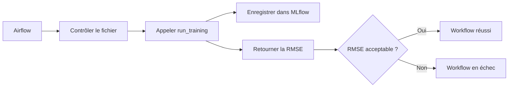

# TP 02 : orchestrer le projet avec Airflow

Vous allez utiliser Apache Airflow pour exécuter le projet `learning-mlops` sous la forme d'un workflow. Le DAG contrôlera le fichier d'entrée, lancera l'entraînement suivi dans MLflow et vérifiera la RMSE obtenue.

Airflow orchestre des traitements par lots. Il ne remplace ni MLflow ni le futur service de prédiction.

## 1. Architecture du TP



Airflow conserve l'état des tâches, leurs journaux et leurs dépendances. Le package `learning_mlops` reste responsable de la préparation des données et de l'entraînement.

## 2. Préparer le projet

Le dépôt doit contenir cette structure :

```text
learning-mlops/
├── dags/
│   └── taxi_training.py
├── data/
│   └── yellow_tripdata_2026-05.parquet
├── src/
│   └── learning_mlops/
│       ├── __init__.py
│       └── train.py
├── .gitignore
└── pyproject.toml
```

Créez le dossier du DAG :

```bash
mkdir -p dags
touch dags/taxi_training.py
```

## 3. Créer un environnement Airflow

Créez un environnement séparé afin de limiter les conflits entre dépendances :

```bash
conda create -n airflow python=3.12 -y
conda activate airflow
python -m pip install --upgrade pip
```

Airflow recommande une installation avec un fichier de contraintes :

```bash
AIRFLOW_VERSION=3.1.0
PYTHON_VERSION="$(python -c 'import sys; print(f"{sys.version_info.major}.{sys.version_info.minor}")')"
CONSTRAINT_URL="https://raw.githubusercontent.com/apache/airflow/constraints-${AIRFLOW_VERSION}/constraints-${PYTHON_VERSION}.txt"

python -m pip install "apache-airflow==${AIRFLOW_VERSION}" --constraint "${CONSTRAINT_URL}"
python -m pip install -e . --constraint "${CONSTRAINT_URL}"
```

La procédure officielle est décrite dans [Installing from PyPI](https://airflow.apache.org/docs/apache-airflow/stable/installation/installing-from-pypi.html).

Vérifiez les installations :

```bash
airflow version
python -c "import learning_mlops; print(learning_mlops.__file__)"
```

## 4. Configurer les dossiers locaux

Depuis la racine du dépôt, définissez les emplacements utilisés par Airflow :

```bash
export AIRFLOW_HOME="$(pwd)/.airflow"
export AIRFLOW__CORE__DAGS_FOLDER="$(pwd)/dags"
```

Ajoutez à `.gitignore` :

```gitignore
.airflow/
```

`AIRFLOW_HOME` contient la base locale, les journaux et la configuration. `AIRFLOW__CORE__DAGS_FOLDER` indique où rechercher les DAGs du projet.

## 5. Créer le DAG

Ouvrez `dags/taxi_training.py` et ajoutez :

```python
from datetime import timedelta
from pathlib import Path

from airflow.exceptions import AirflowException
from airflow.sdk import dag, task
from pendulum import datetime


@dag(
    dag_id="taxi_duration_training",
    description="Entraîne et valide un modèle de durée des trajets",
    schedule=None,
    start_date=datetime(2026, 1, 1, tz="UTC"),
    catchup=False,
    render_template_as_native_obj=True,
    tags=["mlops", "training"],
    params={
        "data_path": "data/yellow_tripdata_2026-05.parquet",
        "model": "xgboost",
        "alpha": 0.01,
        "sample_size": 200000,
        "max_rmse": 10.0,
        "tracking_uri": "http://127.0.0.1:5000",
        "experiment_name": "nyc-taxi-duration",
    },
)
def taxi_duration_training():
```

`schedule=None` impose un déclenchement manuel. `catchup=False` empêche la création automatique d'exécutions historiques. Consultez [DAGs](https://airflow.apache.org/docs/apache-airflow/stable/core-concepts/dags.html), [TaskFlow](https://airflow.apache.org/docs/apache-airflow/stable/tutorial/taskflow.html) et [Params](https://airflow.apache.org/docs/apache-airflow/stable/core-concepts/params.html).

## 6. Ajouter la tâche de contrôle

Dans la fonction `taxi_duration_training`, ajoutez :

```python
    @task(retries=2, retry_delay=timedelta(seconds=30))
    def check_file(data_path: str) -> str:
        path = Path(data_path)
        if not path.is_absolute():
            path = Path(__file__).resolve().parents[1] / path
        if not path.exists():
            raise FileNotFoundError(f"Fichier introuvable : {path}")
        if path.suffix != ".parquet":
            raise ValueError("Le fichier doit être au format Parquet")
        return str(path)
```

Cette tâche vérifie l'entrée avant l'entraînement. Un chemin relatif est résolu depuis la racine du projet, quel que soit le dossier de travail du processus Airflow. Airflow en enregistre chaque tentative et son erreur. Une nouvelle tentative aide lors d'une indisponibilité temporaire, mais ne corrige pas un chemin erroné.

## 7. Ajouter la tâche d'entraînement

Sous la première tâche, ajoutez :

```python
    @task
    def train_model(
        data_path: str,
        model_name: str,
        alpha: float,
        sample_size: int,
        tracking_uri: str,
        experiment_name: str,
    ) -> float:
        from learning_mlops.train import run_training

        return run_training(
            data_path=Path(data_path),
            model_name=model_name,
            alpha=float(alpha),
            sample_size=int(sample_size),
            tracking_uri=tracking_uri,
            experiment_name=experiment_name,
        )
```

Le fichier du DAG reste concentré sur l'orchestration et réutilise la logique présente dans le package.

## 8. Ajouter la validation de la métrique

Ajoutez une troisième tâche :

```python
    @task
    def validate_metric(rmse: float, max_rmse: float) -> None:
        if rmse > float(max_rmse):
            raise AirflowException(
                f"RMSE refusée : {rmse:.4f} > {float(max_rmse):.4f}"
            )
```

Une exception place la tâche et le workflow en échec. Un modèle qui ne respecte pas le critère ne doit pas déclencher l'étape suivante.

## 9. Relier les tâches

Toujours dans la fonction du DAG, ajoutez :

```python
    checked_path = check_file("{{ params.data_path }}")

    rmse = train_model(
        data_path=checked_path,
        model_name="{{ params.model }}",
        alpha="{{ params.alpha }}",
        sample_size="{{ params.sample_size }}",
        tracking_uri="{{ params.tracking_uri }}",
        experiment_name="{{ params.experiment_name }}",
    )

    validate_metric(rmse, "{{ params.max_rmse }}")
```

La valeur retournée par une tâche est transmise à la suivante avec les XComs d'Airflow. Les dépendances apparaissent à travers les valeurs utilisées.

Terminez le fichier, sans indentation, par :

```python
taxi_duration_training()
```

Le fichier complet définit maintenant trois tâches liées dans l'ordre contrôle, entraînement et validation.

## 10. Démarrer MLflow

Dans un premier terminal, activez l'environnement qui contient MLflow et lancez le serveur :

```bash
conda activate mlops
mlflow server \
  --host 0.0.0.0 \
  --port 5000 \
  --backend-store-uri sqlite:///mlflow.db \
  --serve-artifacts \
  --artifacts-destination ./mlartifacts
```

Le paramètre `tracking_uri` du DAG doit pointer vers ce serveur.

## 11. Démarrer Airflow

Dans un deuxième terminal, placez-vous à la racine du dépôt et exécutez :

```bash
conda activate airflow
export AIRFLOW_HOME="$(pwd)/.airflow"
export AIRFLOW__CORE__DAGS_FOLDER="$(pwd)/dags"
airflow standalone
```

La commande initialise l'environnement local et affiche les informations nécessaires pour ouvrir l'interface. Suivez le [Quick Start officiel](https://airflow.apache.org/docs/apache-airflow/stable/start.html) pour le fonctionnement du mode autonome.

## 12. Vérifier le chargement du DAG

Dans un troisième terminal, redéfinissez les variables Airflow puis vérifiez le DAG :

```bash
conda activate airflow
export AIRFLOW_HOME="$(pwd)/.airflow"
export AIRFLOW__CORE__DAGS_FOLDER="$(pwd)/dags"

airflow dags list
airflow dags list-import-errors
```

`taxi_duration_training` doit apparaître dans la liste. Si le fichier contient une erreur d'import, consultez la seconde commande et les journaux.

## 13. Déclencher le workflow

Dans l'interface Airflow :

1. ouvrez le DAG `taxi_duration_training` ;
2. activez-le si nécessaire ;
3. choisissez **Trigger DAG** ;
4. conservez les paramètres proposés ;
5. lancez l'exécution.

Observez la vue du DAG et ouvrez les journaux de chaque tâche. L'exécution doit suivre cet ordre :

```text
check_file -> train_model -> validate_metric
```

Consultez la [documentation sur les tâches](https://airflow.apache.org/docs/apache-airflow/stable/core-concepts/tasks.html) pour interpréter leurs états.

## 14. Vérifier Airflow et MLflow

Après une exécution réussie, vérifiez :

- dans Airflow, l'état des trois tâches et leurs journaux ;
- dans MLflow, la nouvelle exécution de l'expérience `nyc-taxi-duration` ;
- dans MLflow, les paramètres, la RMSE et l'artefact du pipeline.

Airflow indique comment le traitement s'est exécuté. MLflow indique quel entraînement et quel modèle ont été produits.

## 15. Provoquer un échec contrôlé

Déclenchez une nouvelle exécution avec une valeur `max_rmse` inférieure à la RMSE obtenue précédemment.

La tâche `train_model` doit réussir et la tâche `validate_metric` doit échouer. Consultez son journal et identifiez le message produit par `AirflowException`.

Relancez ensuite le DAG avec un seuil acceptable. Cette manipulation montre qu'une reprise conserve l'historique des exécutions précédentes.

## 16. Ajouter une planification mensuelle

Une fois le déclenchement manuel validé, remplacez `schedule=None` par une expression adaptée à une exécution mensuelle. La documentation [Cron and time intervals](https://airflow.apache.org/docs/apache-airflow/stable/authoring-and-scheduling/cron.html) explique les expressions utilisables.

Avant d'activer une planification, remplacez le chemin fixe de mai 2026 par un chemin construit à partir de la période logique du DAG. Un workflow mensuel doit rendre la période traitée visible dans ses paramètres et dans MLflow.

## 17. Exercice

Sans recopier la logique d'entraînement dans le DAG :

1. ajoutez les paramètres XGBoost créés dans l'exercice 14 du support précédent ;
2. transmettez-les de la configuration Airflow à `run_training` ;
3. enregistrez-les dans MLflow ;
4. provoquez un échec avec un fichier inexistant ;
5. corrigez le paramètre et relancez le workflow ;
6. expliquez ce qui est conservé par Airflow et ce qui est conservé par MLflow.

### Conseils

- Commencez avec un seul fichier et un déclenchement manuel.
- Consultez `airflow dags list-import-errors` avant de chercher une erreur dans le modèle.
- Gardez les imports et traitements coûteux à l'intérieur des tâches.
- Utilisez les paramètres du DAG pour les valeurs qui changent entre les exécutions.
- N'enregistrez ni `.airflow` ni les données Parquet dans Git.

## 18. À retenir

Le package Python contient la logique métier. Le DAG appelle cette logique, transmet les paramètres et contrôle l'ordre des tâches. Airflow conserve l'historique opérationnel, tandis que MLflow conserve les informations propres aux expériences et aux modèles.

Sources officielles : [Apache Airflow](https://airflow.apache.org/docs/apache-airflow/stable/), [installation avec pip](https://airflow.apache.org/docs/apache-airflow/stable/installation/installing-from-pypi.html), [Quick Start](https://airflow.apache.org/docs/apache-airflow/stable/start.html), [DAGs](https://airflow.apache.org/docs/apache-airflow/stable/core-concepts/dags.html), [TaskFlow](https://airflow.apache.org/docs/apache-airflow/stable/tutorial/taskflow.html), [Params](https://airflow.apache.org/docs/apache-airflow/stable/core-concepts/params.html) et [Tasks](https://airflow.apache.org/docs/apache-airflow/stable/core-concepts/tasks.html).
