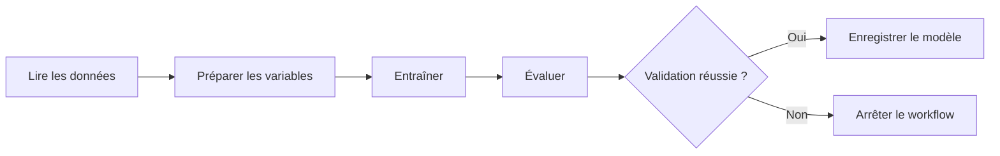

# TP 03 : orchestration

Dans le TP précédent, vous avez suivi les entraînements et enregistré une version du modèle dans MLflow. Vous allez maintenant transformer ces opérations en workflow reproductible.

## Objectifs

À la fin du TP, vous saurez :

- découper un traitement ML en étapes explicites ;
- définir les dépendances entre ces étapes ;
- transmettre des paramètres à un workflow ;
- reprendre une exécution après un échec ;
- enregistrer le résultat du workflow dans MLflow ;
- vérifier le fonctionnement du workflow.

## Position dans le modèle de maturité

L'orchestration consolide le **niveau 2, entraînement automatisé**. Elle rend l'entraînement paramétrable, observable et reproductible.

## Point de départ

Le TP réutilise :

- le fichier Yellow Taxi de mai 2026 ;
- la préparation des données du TP 05 ;
- les entraînements suivis dans MLflow ;
- le modèle `nyc-taxi-duration-model` ;
- l'alias `champion`.

## Progression

1. [Passer du notebook au workflow](01-orchestration-jupyter-to-script.md).
2. [Orchestrer le projet avec Airflow](02-airflow.md).

## Workflow étudié

Chaque étape doit produire un résultat observable. Une erreur doit indiquer l'étape concernée et empêcher la publication d'un modèle non validé.

## Résultat attendu

Le TP doit produire :

- un workflow d'entraînement exécutable avec des paramètres ;
- une exécution visible et compréhensible dans les journaux ;
- un modèle enregistré dans MLflow après validation ;
- une démonstration d'échec contrôlé.

Les outils et les fichiers de chaque étape seront introduits progressivement dans les supports suivants.
