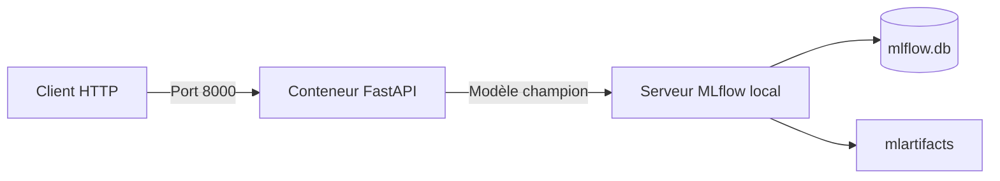

# TP 02 : déployer le service web avec Docker

Vous allez construire une image Docker contenant l'API FastAPI, puis démarrer un conteneur qui charge le modèle `champion` depuis le serveur MLflow local.

## 1. Architecture



L'image contient le code du service et ses dépendances. Le modèle reste géré par MLflow et est téléchargé au démarrage du conteneur.

## 2. Prérequis

Vérifiez que :

- Docker fonctionne avec `docker version` ;
- le projet Python contient `src/learning_mlops/api.py` ;
- le modèle `nyc-taxi-duration-model` possède l'alias `champion` ;
- l'artefact enregistré contient le pipeline complet ;
- les ports 5000 et 8000 sont disponibles.

## 3. Servir les artefacts avec MLflow

Un conteneur ne doit pas dépendre d'un chemin de fichiers propre à la machine hôte. Le serveur MLflow doit donc permettre le téléchargement des artefacts par HTTP.

À la racine du dépôt, lancez MLflow :

```bash
conda activate mlops
mlflow server \
  --host 0.0.0.0 \
  --port 5000 \
  --backend-store-uri sqlite:///mlflow.db \
  --serve-artifacts \
  --artifacts-destination ./mlartifacts
```

Ajoutez `mlartifacts/` à `.gitignore`.

Les nouvelles expériences suivies par ce serveur utilisent son service d'artefacts. Si une ancienne version pointe vers un chemin local inaccessible au conteneur, relancez l'entraînement avec cette configuration, puis enregistrez une nouvelle version et attribuez-lui l'alias `champion`.

Consultez la [documentation du serveur de suivi MLflow](https://mlflow.org/docs/latest/self-hosting/architecture/tracking-server/).

## 4. Créer le Dockerfile

Créez `Dockerfile` à la racine de `learning-mlops` :

```dockerfile
FROM python:3.12-slim

ENV PYTHONDONTWRITEBYTECODE=1
ENV PYTHONUNBUFFERED=1

WORKDIR /app

COPY pyproject.toml README.md ./
COPY src ./src

RUN python -m pip install --no-cache-dir .

EXPOSE 8000

CMD ["uvicorn", "learning_mlops.api:app", "--host", "0.0.0.0", "--port", "8000"]
```

Les instructions ont les rôles suivants :

| Instruction | Rôle |
| --- | --- |
| `FROM` | Choisit l'image Python de départ |
| `WORKDIR` | Définit le dossier de travail dans l'image |
| `COPY` | Ajoute la configuration et le code source |
| `RUN` | Installe le package et ses dépendances |
| `EXPOSE` | Documente le port utilisé par l'API |
| `CMD` | Définit la commande exécutée au démarrage |

La documentation officielle détaille la [construction d'une image](https://docs.docker.com/get-started/docker-concepts/building-images/writing-a-dockerfile/).

## 5. Créer `.dockerignore`

Créez `.dockerignore` à la racine :

```dockerignore
.airflow/
.git/
__pycache__/
data/
mlartifacts/
mlflow.db
mlruns/
models/
*.ipynb
```

Ces fichiers ne sont pas nécessaires à l'exécution de l'API. Les exclure réduit le contexte envoyé au moteur Docker et évite de copier les données ou les fichiers locaux de MLflow dans l'image.

## 6. Construire l'image

Depuis la racine du projet, exécutez :

```bash
docker build -t learning-mlops-api:0.1.0 .
```

Dans cette commande :

- `-t` attribue un nom et une version à l'image ;
- `learning-mlops-api` est le nom choisi ;
- `0.1.0` est le tag de l'image ;
- `.` désigne le contexte de construction.

Vérifiez sa présence :

```bash
docker image ls learning-mlops-api
```

## 7. Comprendre l'accès à MLflow

Dans un conteneur, `127.0.0.1` désigne le conteneur lui-même. Il ne désigne pas la machine qui exécute MLflow.

Le TP utilise le nom `host.docker.internal` pour joindre la machine hôte :

```text
http://host.docker.internal:5000
```

L'option `--add-host` utilisée ensuite fournit aussi cette résolution avec Docker Engine sous Linux.

## 8. Démarrer le conteneur

Exécutez :

```bash
docker run --rm \
  --name learning-mlops-api \
  --add-host=host.docker.internal:host-gateway \
  -p 8000:8000 \
  -e MLFLOW_TRACKING_URI=http://host.docker.internal:5000 \
  -e MODEL_NAME=nyc-taxi-duration-model \
  -e MODEL_ALIAS=champion \
  learning-mlops-api:0.1.0
```

Les options principales sont :

| Option | Rôle |
| --- | --- |
| `--rm` | Supprime le conteneur lorsqu'il s'arrête |
| `--name` | Donne un nom au conteneur |
| `--add-host` | Rend la machine hôte accessible par un nom stable |
| `-p 8000:8000` | Publie le port de l'API |
| `-e` | Transmet une variable d'environnement |

Le journal doit afficher le chargement du modèle avec son nom, son alias et son numéro de version.

Consultez la documentation [Running containers](https://docs.docker.com/get-started/docker-concepts/running-containers/).

## 9. Vérifier l'état du service

Dans un autre terminal :

```bash
curl http://127.0.0.1:8000/health
```

La réponse doit indiquer `ready` et présenter la version du modèle chargée dans le conteneur.

Vérifiez aussi le conteneur :

```bash
docker ps --filter name=learning-mlops-api
```

## 10. Demander une prédiction

Envoyez un trajet :

```bash
curl -X POST http://127.0.0.1:8000/predict \
  -H "Content-Type: application/json" \
  -d '{
    "PULocationID": 161,
    "DOLocationID": 236,
    "trip_distance": 3.2
  }'
```

La réponse doit contenir la durée estimée, le numéro de version et l'identifiant de la requête.

## 11. Lire les journaux

Si le conteneur fonctionne en arrière-plan, affichez ses journaux avec :

```bash
docker logs learning-mlops-api
```

Retrouvez :

- le chargement du modèle ;
- le numéro de version ;
- l'identifiant de la requête ;
- la latence de la prédiction.

## 12. Tester une erreur de configuration

Arrêtez le conteneur avec `Ctrl + C`, puis relancez-le avec un alias inexistant :

```bash
docker run --rm \
  --name learning-mlops-api \
  --add-host=host.docker.internal:host-gateway \
  -p 8000:8000 \
  -e MLFLOW_TRACKING_URI=http://host.docker.internal:5000 \
  -e MODEL_NAME=nyc-taxi-duration-model \
  -e MODEL_ALIAS=unknown \
  learning-mlops-api:0.1.0
```

Le conteneur doit s'arrêter avec une erreur explicite, car le service ne peut pas charger le modèle demandé. Corrigez l'alias avant de continuer.

## 13. Modifier l'alias `champion`

Dans MLflow, attribuez l'alias `champion` à une autre version validée. Redémarrez ensuite le conteneur avec la commande normale.

Appelez `/health` et vérifiez le nouveau numéro de version. L'image Docker reste identique, car la sélection du modèle est fournie par la configuration.

## 14. Exercice

Sans modifier le code de l'API :

1. construisez une image avec le tag `0.2.0` ;
2. démarrez-la sur le port hôte 8001 ;
3. utilisez l'alias `challenger` ;
4. vérifiez la version avec `/health` ;
5. envoyez le même trajet aux conteneurs `champion` et `challenger` ;
6. comparez les prédictions et les journaux ;
7. expliquez la différence entre la version de l'image et la version du modèle.

### Conseils

- Le port placé à gauche dans `-p` appartient à la machine hôte.
- Deux conteneurs ne peuvent pas publier le même port hôte.
- Vérifiez MLflow avant d'analyser une erreur de chargement dans FastAPI.
- Utilisez `docker logs` lorsque `/health` ne répond pas.
- Reconstruisez l'image après une modification du code ou des dépendances.
- Un changement d'alias nécessite un redémarrage, mais pas une nouvelle image.

## 15. À retenir

L'image Docker versionne le code et l'environnement du service. MLflow versionne le modèle. Les variables d'environnement relient le conteneur au registre et sélectionnent l'alias à charger. Cette séparation permet de changer de modèle sans reconstruire l'image du service.

Sources : [Dockerfile overview](https://docs.docker.com/build/concepts/dockerfile/), [Build an image](https://docs.docker.com/get-started/docker-concepts/building-images/) et [Run a container](https://docs.docker.com/get-started/docker-concepts/running-containers/).
