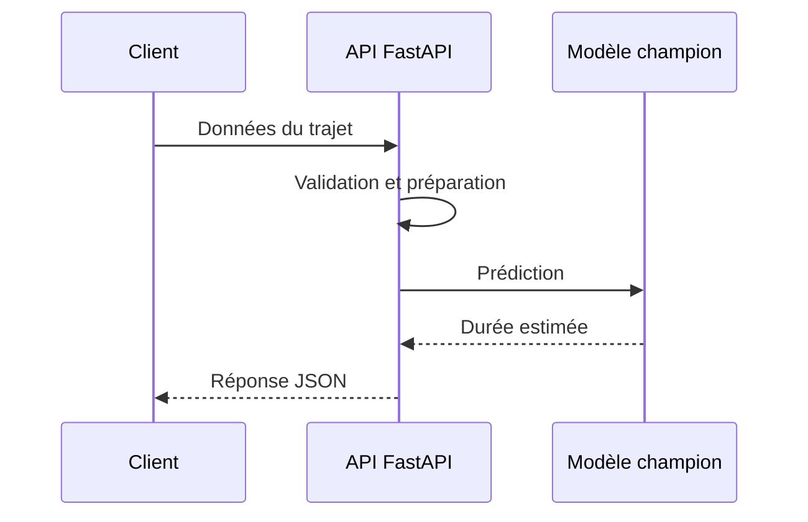
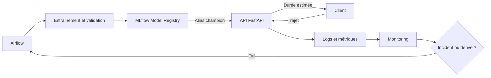

# TP 04 : déploiement et monitoring

Le workflow Airflow produit et valide un modèle. Cette dernière partie consiste à rendre une version utilisable, puis à vérifier que le service et ses prédictions restent fiables.

## 1. Objectifs

Vous allez :

- charger le modèle désigné par l'alias MLflow `champion` ;
- exposer une prédiction avec une API FastAPI ;
- valider les données reçues par le service ;
- exécuter l'API dans un conteneur Docker ;
- tester une requête valide et une requête incorrecte ;
- enregistrer des indicateurs sur le service, les données et les prédictions ;
- distinguer un incident technique d'une dégradation du modèle.

## 2. Qu'est-ce que déployer un modèle ?

Entraîner un modèle produit un objet capable de calculer une prédiction. Déployer ce modèle consiste à l'intégrer dans un système accessible, reproductible et observable.

Dans ce cours, le modèle sera exposé comme un **service web**. Une application enverra les caractéristiques d'un trajet dans une requête HTTP et recevra une durée estimée dans la réponse.



Le déploiement doit répondre à plusieurs questions :

- quelle version du modèle est utilisée ?
- quelles données le service accepte-t-il ?
- comment les variables sont-elles transformées ?
- comment le service démarre-t-il et signale-t-il une erreur ?
- quelles informations permettent de surveiller son fonctionnement ?

## 3. Entraînement et service de prédiction

| Entraînement | Service de prédiction |
| --- | --- |
| Lit un jeu de données historique | Reçoit un nouveau trajet |
| Ajuste les paramètres du modèle | Utilise les paramètres déjà appris |
| Calcule une métrique de validation | Retourne une durée estimée |
| Produit une version dans MLflow | Charge une version validée |
| Peut être relancé par Airflow | Reste disponible pour répondre aux requêtes |

Le service ne doit pas réentraîner le modèle lorsqu'il reçoit une requête. Il charge le pipeline une fois au démarrage, puis le réutilise.

## 4. Position dans le modèle de maturité

Cette partie prépare le **niveau 3, déploiement automatisé**. Le modèle enregistré devient accessible à une application et son fonctionnement peut être contrôlé.

Un déploiement manuel dans Docker constitue une première étape reproductible. Le niveau 3 demande ensuite que la livraison d'une version validée soit réalisée par un processus automatisé et contrôlé.

## 5. Architecture étudiée



Airflow orchestre l'entraînement. MLflow conserve et désigne la version. FastAPI répond aux demandes de prédiction. Le monitoring fournit les informations nécessaires pour détecter un problème et reprendre le cycle.

## 6. Composants du déploiement local

| Composant | Responsabilité |
| --- | --- |
| **MLflow Model Registry** | Conserver les versions et indiquer le modèle `champion` |
| **Pipeline scikit-learn** | Appliquer `DictVectorizer` puis calculer la prédiction |
| **FastAPI** | Valider la requête et exposer le modèle avec HTTP |
| **Docker** | Fournir un environnement d'exécution reproductible |
| **Client HTTP** | Envoyer un trajet et exploiter la réponse |
| **Logs et métriques** | Rendre le comportement du service observable |

Le conteneur exécutera l'API sur la machine de l'étudiant. Il devra pouvoir joindre le serveur MLflow local ou utiliser un artefact récupéré avant son démarrage.

## 7. Contrat de prédiction

Le service recevra les informations disponibles au moment de la demande :

| Champ | Type | Règle |
| --- | --- | --- |
| `PULocationID` | entier | identifiant de la zone de départ |
| `DOLocationID` | entier | identifiant de la zone d'arrivée |
| `trip_distance` | nombre | valeur positive exprimée en miles |

Le service construira la variable `PU_DO`, appellera le pipeline enregistré et retournera une durée en minutes.

Exemple de réponse attendue :

```json
{
  "duration_minutes": 14.7,
  "model_name": "nyc-taxi-duration-model",
  "model_alias": "champion"
}
```

Le nom et l'alias permettent d'identifier la référence utilisée. En production, le numéro exact de la version doit également apparaître dans les traces.

## 8. Étapes du déploiement

Suivez le TP [Exposer le modèle avec FastAPI](01-web-service.md) pour réaliser le service web connecté au registre MLflow.

1. créer le module de prédiction dans le package Python ;
2. charger le modèle avec l'URI MLflow fondée sur l'alias `champion` ;
3. créer une route FastAPI de contrôle ;
4. créer une route de prédiction ;
5. valider les entrées et traiter les erreurs ;
6. tester l'API localement ;
7. construire une image Docker ;
8. démarrer le conteneur avec la configuration MLflow ;
9. vérifier la réponse et les journaux.

Le chargement du modèle doit être séparé du traitement d'une requête. Télécharger le même modèle à chaque appel rendrait le service lent et dépendant du registre pour chaque prédiction.

## 9. Trois niveaux de monitoring

### Service

Le monitoring technique vérifie que l'API fonctionne :

- nombre de requêtes ;
- temps de réponse ;
- taux d'erreurs ;
- disponibilité ;
- version du modèle chargée.

### Données

Le monitoring des entrées vérifie ce que reçoit le modèle :

- valeurs manquantes ou refusées ;
- distances négatives ou inhabituelles ;
- zones inconnues ;
- évolution des distributions ;
- volume de requêtes.

### Modèle

Le monitoring des prédictions observe :

- distribution des durées estimées ;
- valeurs extrêmes ;
- différence entre données de référence et données récentes ;
- erreur réelle lorsque la durée observée devient disponible.

La performance du modèle ne peut pas être calculée immédiatement si la valeur réelle arrive plus tard. Il faut alors relier la prédiction à l'observation correspondante.

## 10. Incident technique et dérive

| Situation | Type | Exemple d'action |
| --- | --- | --- |
| L'API ne répond plus | Incident technique | redémarrer le service et analyser les journaux |
| Le registre MLflow est inaccessible au démarrage | Incident technique | conserver la version déployée et rétablir l'accès |
| Les distances reçues augmentent fortement | Dérive des données | comparer avec la période de référence |
| La RMSE augmente sur les trajets récents | Dégradation du modèle | évaluer un nouvel entraînement |
| Quelques requêtes sont invalides | Qualité des entrées | refuser les données et suivre leur fréquence |

Une alerte doit conduire à une action définie. Elle ne doit pas déclencher automatiquement un nouvel entraînement sans contrôle des données et du critère de validation.

## 11. Résultat attendu

À la fin de cette partie, le projet devra contenir :

- une API capable de charger le modèle `champion` ;
- un schéma de validation des requêtes ;
- un endpoint de contrôle et un endpoint de prédiction ;
- un Dockerfile reproductible ;
- des tests de requêtes valides et invalides ;
- des journaux contenant la version du modèle et le résultat de la requête ;
- une liste d'indicateurs et de seuils à surveiller ;
- une procédure simple en cas d'incident ou de dérive.

La création de l'API est détaillée dans `01-web-service.md`. Poursuivez avec [le déploiement du service dans Docker](02-deploy-docker-image.md), puis avec [le monitoring Evidently](03-monitoring.md).

Source d'organisation : [MLOps Zoomcamp, Model Deployment](https://github.com/DataTalksClub/mlops-zoomcamp/blob/main/04-deployment/README.md).
